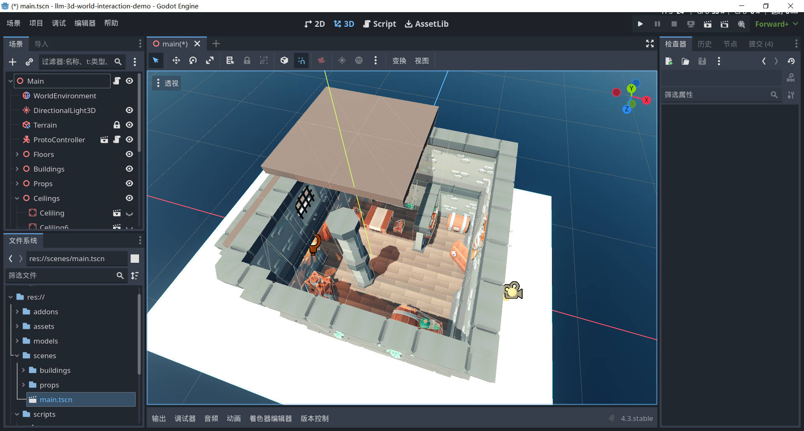
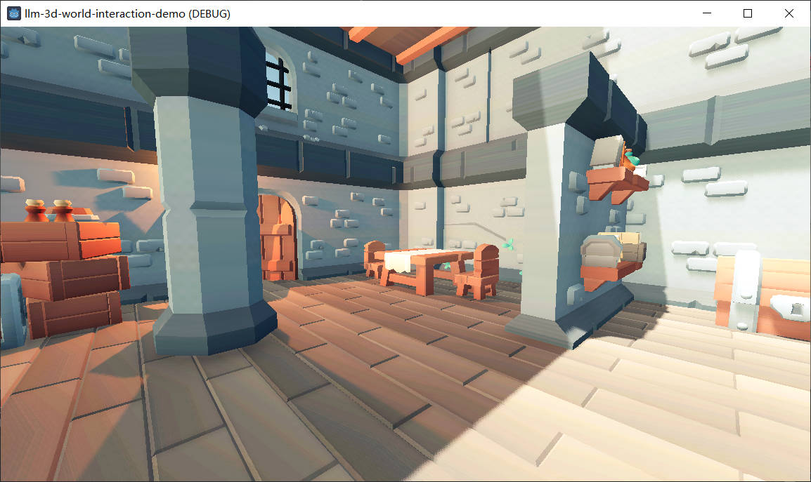

# 基于Godot实现LLM交互3D场景Demo

>本项目是阿里云数据可视化产品 DataV 团队在三维交互领域前沿探索的初步复现，详细请参考延伸阅读部分。

## 一、项目结构
~~~
project/
├── addons/                    # 存放外部插件
├── assets/                    # 存放所有资源文件（如纹理、音频等）
├── models/                    # 存放所有模型文件
├── scenes/                    # 存放所有场景文件（.tscn）
├── scripts/                   # 存放所有脚本文件（.gd）
│   ├── pyscript/              # 项目依赖的Python子项目根目录
│   ├── commons.gd             # GDScript脚本工具类
│   ├── llm_interactions.gd    # 与LLM进行交互的处理脚本
│   └── main.gd                # 主控制脚本，包含生成模型描述文件等函数
└── target/                    # 游戏编译结果
~~~

## 二、启动方法

Ⅰ、安装 [**Godot**](https://godotengine.org/) 以及 [**uv Python** 项目和依赖管理工具](https://hellowac.github.io/uv-zh-cn/)，在 Godot 中导入并进入项目；

打开 `res://scenes/main.tscn` 主场景，点击“Play Scene”按钮即可运行游戏。

>注意：您可以在项目设置中选择3D物理引擎为 **Jolt** 以达到更优的性能。

Ⅱ、进入 `res://scripts/pyscript` **Python 项目**，按照 `README.md` 的要求运行py脚本。

Ⅲ、通过运行游戏的方式执行 `main.gd` 脚本，生成节点描述文件；

执行完毕后关闭游戏，让 `llm_interaction.gd` 在编辑器模式下自动运行。

Ⅳ、`llm_interaction.gd` 工具脚本将会在编辑器模式下**监听**由 `rag_interaction.py` 生成的**关于交互指令的函数调用描述文件**；

当这个描述文件发生更新时，工具脚本将会调用函数来解析文件中的**参数**，从而执行对应的**操作函数**，如 `swawn_object()`。

## 延伸阅读
- [How to make 3D Games in Godot](https://www.youtube.com/watch?v=ke5KpqcoiIU)
- [基于LLM打造沉浸式3D世界](https://mp.weixin.qq.com/s/ozQHvZ5eRNLZwqhcu3QPvQ)
